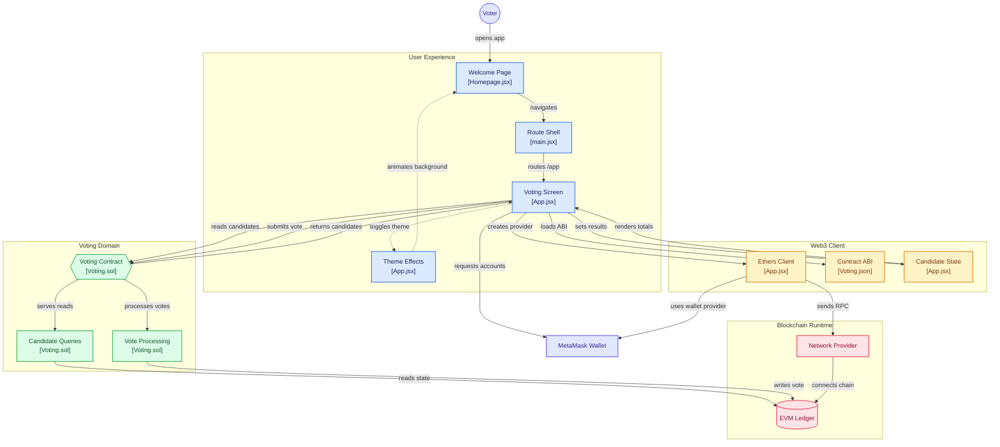

# Online Voting System Using Blockchain

A blockchain-based online voting system built using **Solidity, Hardhat, React, Ethers.js, and MetaMask**.

## 🚀 Features

- Blockchain-based voting
- Solidity smart contract
- MetaMask wallet integration
- React frontend
- Ethers.js Web3 integration
- Candidate vote counting
- Real-time voting results
- Decentralized vote storage

## 🛠️ Technologies Used

- **Frontend:** React.js
- **Smart Contract:** Solidity
- **Blockchain:** Ethereum / EVM
- **Development Framework:** Hardhat
- **Web3 Library:** Ethers.js
- **Wallet:** MetaMask
- **Version Control:** Git & GitHub

## 🏗️ System Architecture

The following diagram illustrates the architecture and flow of the blockchain-based online voting system.



## 📁 Project Structure

```text
online-voting-system-using-blockchain/
│
├── client/
│   └── src/
│       ├── App.jsx
│       ├── Homepage.jsx
│       ├── main.jsx
│       └── artifacts/
│           └── contracts/
│               └── Voting.sol/
│                   └── Voting.json
│
├── contracts/
│   └── Voting.sol
│
├── ignition/
│   └── modules/
│
├── test/
│
├── hardhat.config.js
├── package.json
└── README.md
```

## ⚙️ Installation

Clone the repository:

```bash
git clone https://github.com/shaikyasirahmed07/online-voting-system-using-blockchain.git
```

Navigate to the project:

```bash
cd online-voting-system-using-blockchain
```

Install dependencies:

```bash
npm install
```

## 🧪 Hardhat Commands

### Compile the Smart Contract

```bash
npx hardhat compile
```

### Run Tests

```bash
npx hardhat test
```

### Run Tests with Gas Report

```bash
REPORT_GAS=true npx hardhat test
```

### Start Local Blockchain

```bash
npx hardhat node
```

### Deploy Smart Contract

```bash
npx hardhat ignition deploy ./ignition/modules/Lock.js
```

## 🔄 Application Workflow

```text
Voter
  │
  ▼
Homepage
  │
  ▼
Voting Screen
  │
  ▼
MetaMask Wallet
  │
  ▼
Ethers.js
  │
  ▼
Voting Smart Contract
  │
  ▼
EVM Blockchain
  │
  ▼
Vote Stored
  │
  ▼
Updated Candidate Results
  │
  ▼
Voting Screen
```

## 🔐 Smart Contract

The main voting smart contract is located at:

```text
contracts/Voting.sol
```

The smart contract handles:

- Candidate management
- Candidate information retrieval
- Vote processing
- Vote counting
- Blockchain state updates

## 🌐 Frontend

The frontend is developed using React.js.

Important files:

```text
client/src/App.jsx
client/src/Homepage.jsx
client/src/main.jsx
```

The frontend communicates with the blockchain through **Ethers.js** and the user's **MetaMask wallet**.

## 🦊 MetaMask

MetaMask is used as the user's blockchain wallet.

The basic interaction flow is:

```text
React Application
       │
       ▼
   MetaMask
       │
       ▼
   Ethers.js
       │
       ▼
Voting Smart Contract
       │
       ▼
 Ethereum / EVM Network
```

## 📊 Voting Process

1. The voter opens the application.
2. The voter navigates to the voting screen.
3. MetaMask is connected.
4. The application creates an Ethers.js provider.
5. Candidate information is retrieved from the smart contract.
6. The voter selects a candidate.
7. MetaMask requests transaction confirmation.
8. The vote is submitted to the smart contract.
9. The smart contract updates the vote count.
10. The updated results are displayed in the frontend.

## 📜 License

This project is created for educational and demonstration purposes.

## 👨‍💻 Author

**Shaik Yasir Ahmed**

GitHub: https://github.com/shaikyasirahmed07
